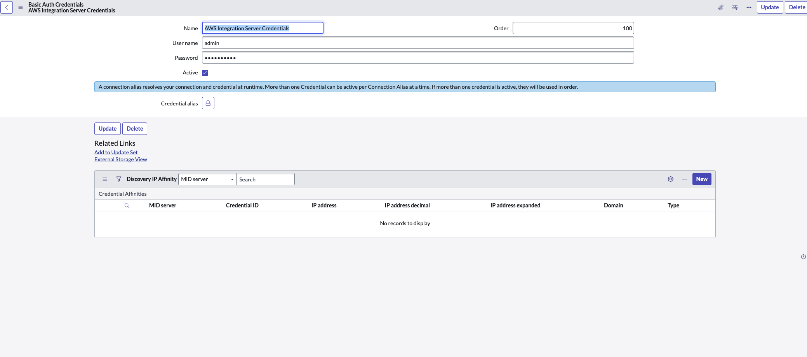
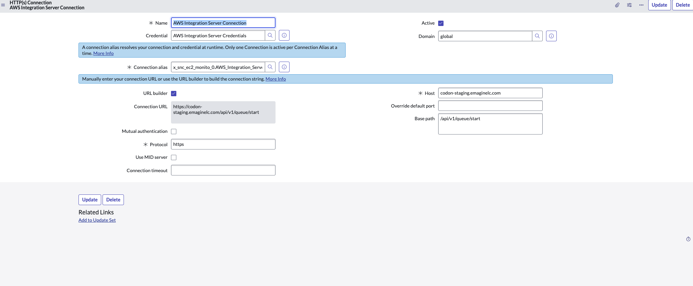
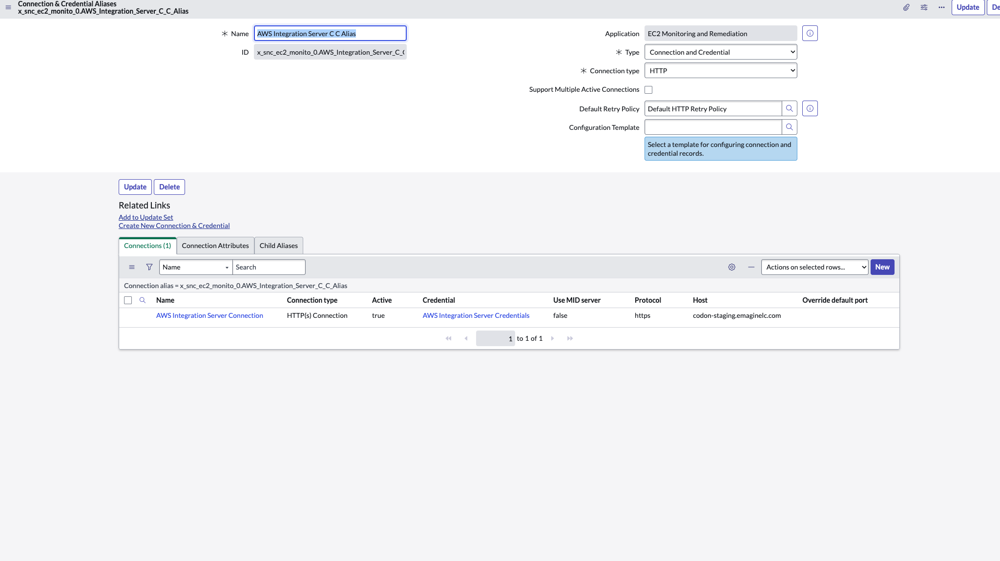
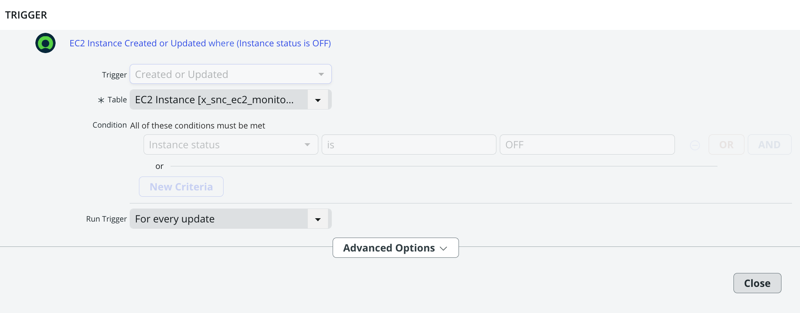
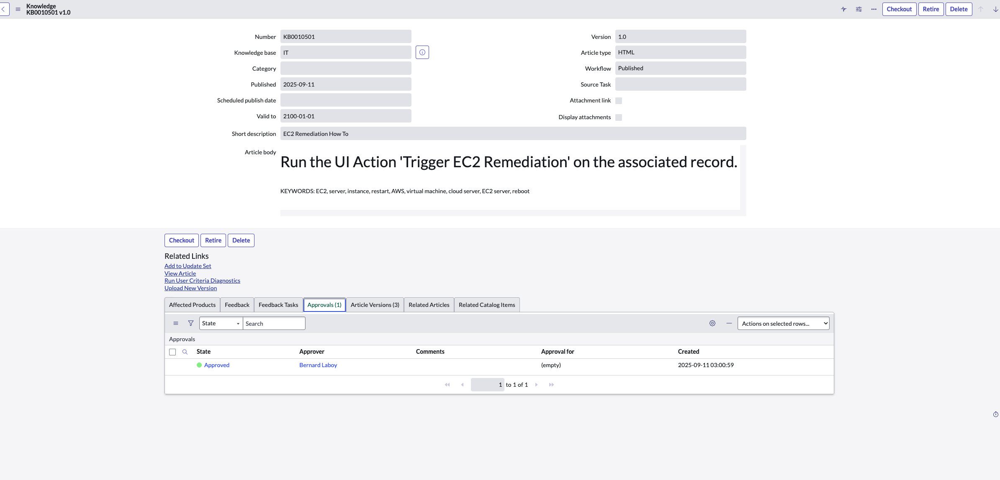
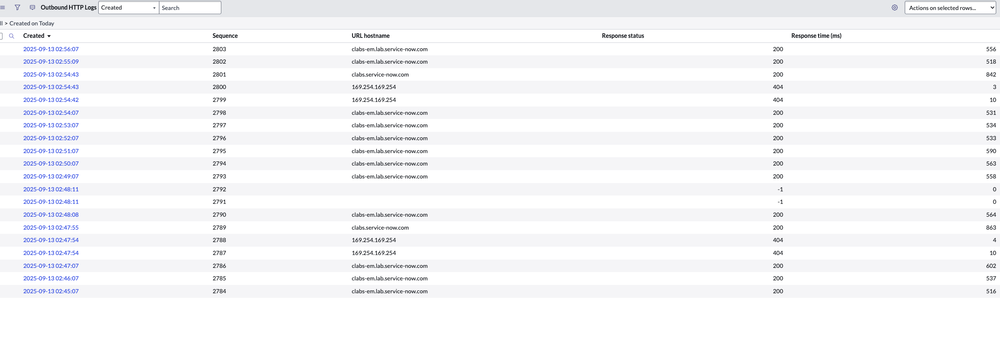

# 🚀 EC2 Monitoring and Remediation System  
*ServiceNow Implementation for Netflix DevOps*

---

## 📌 System Overview
This project delivers a **semi-automated incident response system** that helps Netflix’s DevOps team quickly detect and remediate failing AWS EC2 instances.  

When an EC2 instance fails:  
✅ The **AWS Integration Server** updates ServiceNow every minute with instance status.  
✅ **Flow Designer** triggers on `status = OFF` to:  
- Create an **incident record**  
- Run **AI Search** to retrieve Knowledge Base guidance  
- Send a **Slack notification** with remediation steps  

✅ Engineers can then use a **one-click remediation button** in ServiceNow to call the AWS Integration Server API and restart the instance.  
✅ Every attempt is recorded in the **Remediation Log table** for auditing.  

---

## 🛠️ Technologies Used
- **AWS EC2** – Cloud infrastructure powering Netflix’s services  
- **AWS Integration Server** – Health monitoring + API gateway for remediation  
- **ServiceNow Scoped Application** – EC2 Monitoring & Remediation (scope: `x_snc_ec2_monito_0`)  
- **ServiceNow Flow Designer** – Automated workflows for incidents, AI Search, and Slack notifications  
- **ServiceNow UI Action & Script Include** – One-click remediation (`Trigger EC2 Remediation` + `EC2RemediationHelper`)  
- **AI Search** – Intelligent knowledge retrieval for remediation guidance  
- **Slack Webhooks** – Real-time DevOps notifications  
- **Custom Tables** – `EC2 Instance` + `Remediation Log`  
- **System/HTTP Logs** – Audit trail of incidents, API calls, and remediation attempts  

---

## ⚙️ Implementation Steps
1. **Scoped Application Setup**  
2. **Custom Tables** (EC2 Instance + Remediation Log)  
3. **AWS Integration Configuration** (Credentials, HTTP Connection, Connection Alias)  
4. **UI Action & Script Include Setup**  
5. **Flow Designer Workflow** (Trigger on OFF status, Incident Creation, AI Search, Variables, Slack Message)  
6. **Knowledge Base Article Creation**  
7. **Validation with Logs** (Remediation Log + Outbound HTTP Logs)  

---

## 🖼️ Architecture Diagram
  
*Figure 1: End-to-end workflow for EC2 monitoring and remediation system.*

---

## 🔧 Optimization
- Enabled **AI Search Logging** for transparency  
- Implemented **audit trail** with System Logs + HTTP Logs  
- Used **Force Save** in Flow Designer to capture all workflow components  
- Removed **Slack webhook token** before publishing to GitHub for security  

---

## 👨‍💻 DevOps Usage
1. **Monitor EC2 Status** (EC2 Instance table)  
2. **Receive Notifications** (Slack alerts + Incident creation)  
3. **Perform Remediation** (UI Action → AWS API call)  
4. **Review Logs** (Remediation Log + System/HTTP logs)  
5. **Use Knowledge Base** (AI Search for remediation steps)  

---

## 📸 Screenshots  

### 1. AWS Integration Setup  

**1a. Basic Auth Credentials**  
  
*Configured AWS Integration Server credentials to securely authenticate API requests.*  

**1b. HTTP Connection**  
  
*Configured HTTPS connection to the AWS Integration Server endpoint for remediation calls.*  

**1c. Connection & Credential Alias**  
  
*Mapped the AWS connection and credentials into a reusable alias for workflows and UI actions.*  

---

### 2. EC2 Instance Table  
  
*Displays auto-populated EC2 instance records with instance ID, name, and current status (ON/OFF).*

---

### 3. Flow Designer Workflow  

**3a. Workflow Overview**  
  
*End-to-end Flow Designer workflow triggered when an EC2 instance status = OFF.*  

**3b. Trigger Setup**  
  
*Trigger configured on the EC2 Instance table when instance status = OFF.*  

**3c. Incident Record Creation**  
  
*Creates a high-priority incident automatically when a failed EC2 instance is detected.*  

**3d. AI Search Custom Action**  
  
*AI Search retrieves remediation instructions from the Knowledge Base using EC2-related keywords.*  

**3e. Set Flow Variables**  
  
*Flow variables populated with instance details, KB link, and remediation data.*  

**3f. Message Step**  
  
*Slack message step configured to notify DevOps engineers with incident details and KB guidance.*  

---

### 4. Incident Record  
  
*Incident automatically created in ServiceNow linking the failed EC2 instance to DevOps operations.*  

---

### 5. Slack Notification  
  
*Slack notification posted to DevOps channel containing remediation details and incident reference.*  

---

### 6. UI Action – Trigger EC2 Remediation  
  
*One-click remediation button added to the EC2 Instance record form for engineers to restart instances directly.*  

---

### 7. Knowledge Base Article  
  
*Knowledge Base article containing EC2 remediation steps. Indexed keywords allow AI Search to find it automatically.*  

---

### 8. Remediation Log Table  
  
*Custom log table capturing remediation attempts, HTTP codes, request/response payloads, success flags, and timestamps.*  

---

### 9. Outbound HTTP Logs  
  
*System logs verifying ServiceNow executed outbound API calls to AWS and Slack during remediation.*  

---

✨ With this system, Netflix’s DevOps team can resolve EC2 failures faster, reduce downtime, and protect streaming quality for millions of viewers worldwide.  
