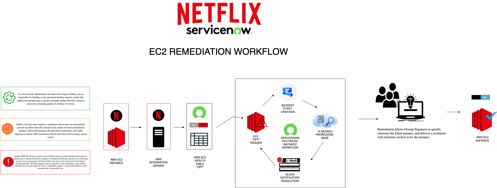
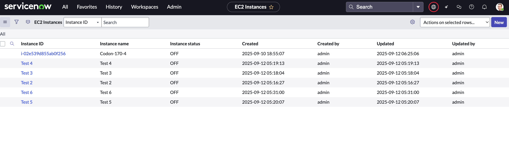
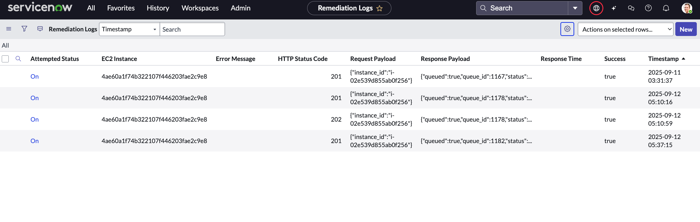
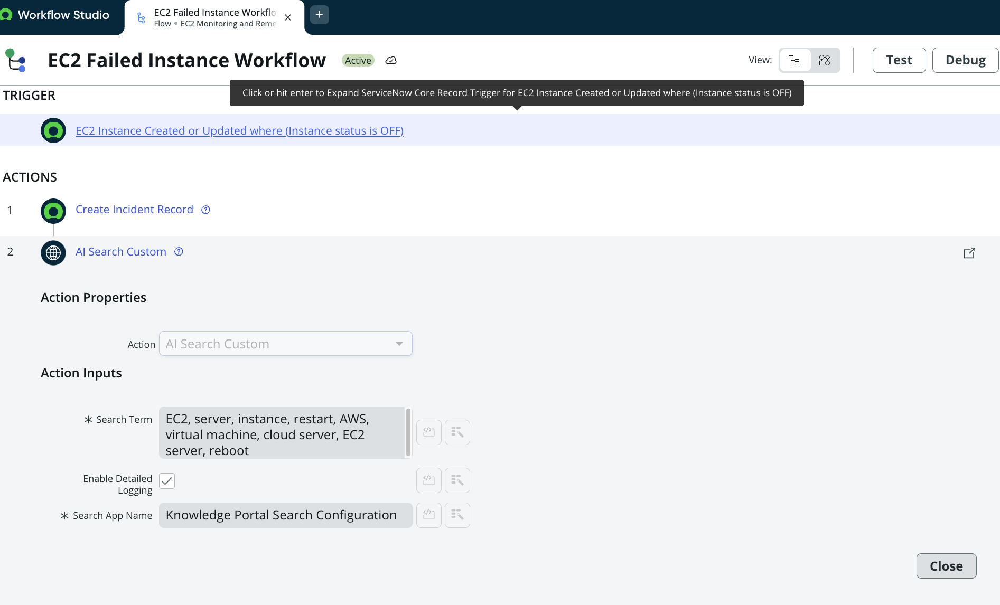
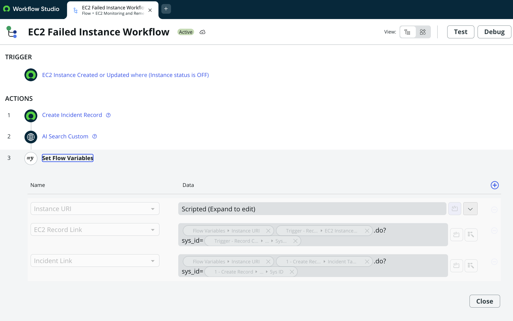
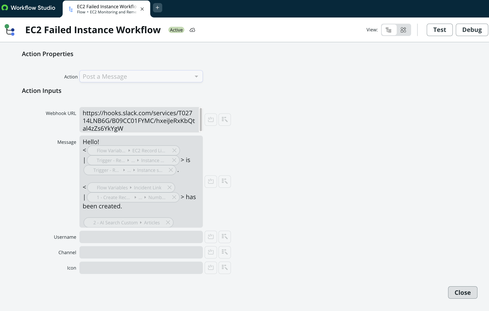
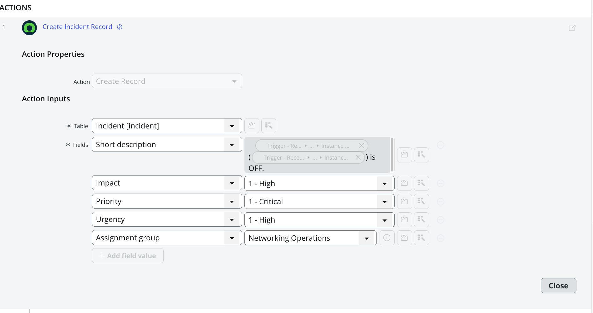
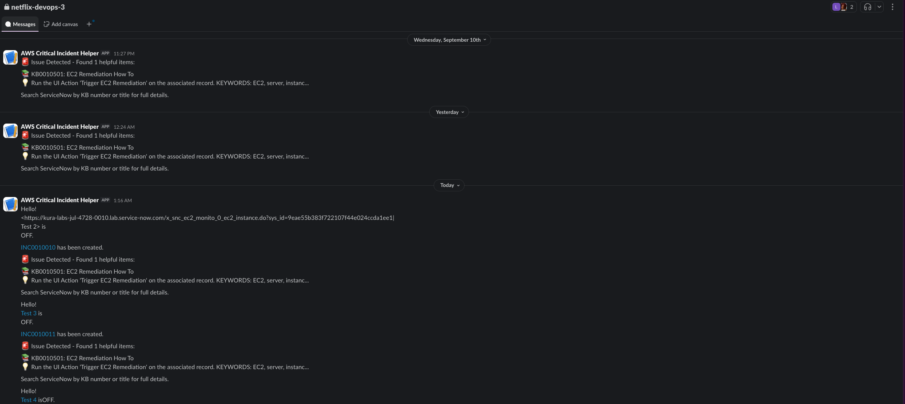
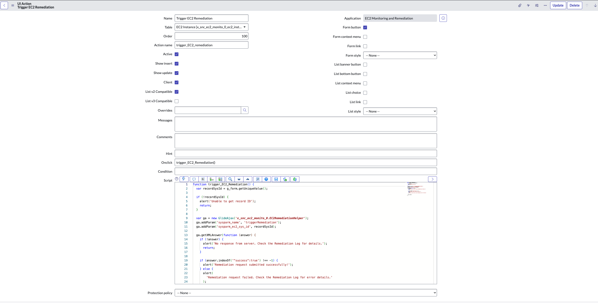

# 🚀 EC2 Monitoring and Remediation System  
*ServiceNow Implementation for Netflix DevOps*

---

## 📌 System Overview
This project delivers a **semi-automated incident response system** that helps Netflix’s DevOps team quickly detect and remediate failing AWS EC2 instances.  

When an EC2 instance fails:  
✅ The **AWS Integration Server** updates ServiceNow every minute with instance status.  
✅ **Flow Designer** triggers on `status = OFF` to:  
- Create an **incident record**  
- Run **AI Search** to retrieve Knowledge Base guidance  
- Send a **Slack notification** with remediation steps  

✅ Engineers can then use a **one-click remediation button** in ServiceNow to call the AWS Integration Server API and restart the instance.  
✅ Every attempt is recorded in the **Remediation Log table** for auditing.  

---

## 🛠️ Technologies Used
- **AWS EC2** – Cloud infrastructure powering Netflix’s services  
- **AWS Integration Server** – Health monitoring + API gateway for remediation  
- **ServiceNow Scoped Application** – EC2 Monitoring & Remediation (scope: `x_snc_ec2_monito_0`)  
- **ServiceNow Flow Designer** – Automated workflows for incidents, AI Search, and Slack notifications  
- **ServiceNow UI Action & Script Include** – One-click remediation (`Trigger EC2 Remediation` + `EC2RemediationHelper`)  
- **AI Search** – Intelligent knowledge retrieval for remediation guidance  
- **Slack Webhooks** – Real-time DevOps notifications  
- **Custom Tables** – `EC2 Instance` + `Remediation Log`  
- **System/HTTP Logs** – Audit trail of incidents, API calls, and remediation attempts  

---

## ⚙️ Implementation Steps
1. **Scoped Application Setup**  
2. **Custom Tables** (EC2 Instance + Remediation Log)  
3. **AWS Integration Configuration**  
4. **UI Action & Script Include Setup**  
5. **Flow Designer Workflow** (Trigger on OFF status)  
6. **Knowledge Base Article Creation**  

---

## 🖼️ Architecture Diagram
  
*Figure 1: Full workflow for EC2 monitoring and remediation system.*

---

## 🔧 Optimization
- Enabled **AI Search Logging** for transparency  
- Implemented **audit trail** with System Logs + HTTP Logs  
- Used **Force Save** in Flow Designer to capture all workflow components  
- Removed **Slack webhook token** before publishing to GitHub for security  

---

## 👨‍💻 DevOps Usage
1. **Monitor EC2 Status** (EC2 Instance table)  
2. **Receive Notifications** (Slack alerts + Incident creation)  
3. **Perform Remediation** (UI Action → AWS API call)  
4. **Review Logs** (Remediation Log + System/HTTP logs)  
5. **Use Knowledge Base** (AI Search for remediation steps)  

---

## 📸 Screenshots

### 1. EC2 Instance Table  
  
*Displays auto-populated EC2 instance records with instance ID, name, and current status (ON/OFF).*

### 2. Remediation Log Table  
  
*Tracks all remediation attempts with request payloads, responses, success/failure flags, and timestamps.*

### 3. Flow Designer Workflow  
  
*Workflow that triggers on EC2 status = OFF, creates incidents, retrieves KB articles, and sends Slack notifications.*

#### 3a. AI Search Custom Action  
  
*Configuration of the AI Search action that retrieves Knowledge Base articles during incident workflows.*

#### 3b. Set Flow Variables  
  
*Step showing how flow variables are set and passed through the workflow.*

#### 3c. Message Step  
  
*Slack message step showing how notifications with KB links are delivered to the DevOps channel.*

### 4. Incident Record  
  
*Automatically created ServiceNow incident linked to the failed EC2 instance.*

### 5. Slack Notification  
  
*Message posted to the DevOps Slack channel with remediation guidance and incident details.*

### 6. UI Action – Trigger EC2 Remediation  
  
*One-click remediation button on the EC2 Instance record form.*

### 7. System & HTTP Logs  
  
*Logs showing AI Search execution, Slack webhook delivery, and AWS API call results.*

---

✨ With this system, Netflix’s DevOps team can resolve EC2 failures faster, reduce downtime, and protect streaming quality for millions of viewers worldwide.  
