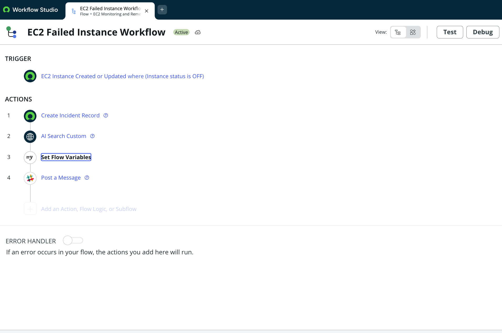

# 🚀 EC2 Monitoring and Remediation System  
*ServiceNow Implementation for Netflix DevOps*

---

## 📌 System Overview
This project delivers a **semi-automated incident response system** that helps Netflix’s DevOps team quickly detect and remediate failing AWS EC2 instances.  

When an EC2 instance fails:  
✅ The **AWS Integration Server** updates ServiceNow every minute with instance status.  
✅ **Flow Designer** triggers on `status = OFF` to:  
- Create an **incident record**  
- Run **AI Search** to retrieve Knowledge Base guidance  
- Send a **Slack notification** with remediation steps  

✅ Engineers can then use a **one-click remediation button** in ServiceNow to call the AWS Integration Server API and restart the instance.  
✅ Every attempt is recorded in the **Remediation Log table** for auditing.  

---

## 🛠️ Technologies Used
- **AWS EC2** – Cloud infrastructure powering Netflix’s services  
- **AWS Integration Server** – Health monitoring + API gateway for remediation  
- **ServiceNow Scoped Application** – EC2 Monitoring & Remediation (scope: `x_snc_ec2_monito_0`)  
- **ServiceNow Flow Designer** – Automated workflows for incidents, AI Search, and Slack notifications  
- **ServiceNow UI Action & Script Include** – One-click remediation (`Trigger EC2 Remediation` + `EC2RemediationHelper`)  
- **AI Search** – Intelligent knowledge retrieval for remediation guidance  
- **Slack Webhooks** – Real-time DevOps notifications  
- **Custom Tables** – `EC2 Instance` + `Remediation Log`  
- **System/HTTP Logs** – Audit trail of incidents, API calls, and remediation attempts  

---

## ⚙️ Implementation Steps
1. **Scoped Application Setup**  
2. **Custom Tables** (EC2 Instance + Remediation Log)  
3. **AWS Integration Configuration** (Credentials, HTTP Connection, Connection Alias)  
4. **UI Action & Script Include Setup**  
5. **Flow Designer Workflow** (Trigger on OFF status, Incident Creation, AI Search, Variables, Slack Message)  
6. **Knowledge Base Article Creation**  
7. **Validation with Logs** (Remediation Log + Outbound HTTP Logs)  

---

## 🖼️ Architecture Diagram
  
*Figure 1: End-to-end workflow for EC2 monitoring and remediation system.*

---

## 🔧 Optimization
- Enabled **AI Search Logging** for transparency  
- Implemented **audit trail** with System Logs + HTTP Logs  
- Used **Force Save** in Flow Designer to capture all workflow components  
- Removed **Slack webhook token** before publishing to GitHub for security  

---

## 👨‍💻 DevOps Usage
1. **Monitor EC2 Status** (EC2 Instance table)  
2. **Receive Notifications** (Slack alerts + Incident creation)  
3. **Perform Remediation** (UI Action → AWS API call)  
4. **Review Logs** (Remediation Log + System/HTTP logs)  
5. **Use Knowledge Base** (AI Search for remediation steps)  

---

## 📸 Screenshots

### 1. Application Setup  
  
*Created a scoped application named **EC2 Monitoring and Remediation**. This ensures the scope (`x_snc_ec2_monito_0`) is generated correctly for AWS Integration compatibility.*

---

### 2. Table Structure – EC2 Instance & Remediation Log  
  
*EC2 Instance table auto-populated by the AWS Integration Server every minute with instance IDs and ON/OFF status.*  

  
*Custom Remediation Log table tracks remediation attempts, including request payloads, response payloads, HTTP status codes, and success/failure flags.*

---

### 3. AWS Integration Configuration  
  
*Created credentials for authenticating with the AWS Integration Server.*  

  
*Configured the connection record with hostname and base path to connect ServiceNow with AWS.*  

  
*Set up Connection & Credential Alias for consistent referencing across the scoped app.*

---

### 4. UI Action and Script Include  
  
*UI Action “Trigger EC2 Remediation” added to the EC2 Instance form, enabling one-click remediation.*  

  
*Script Include `EC2RemediationHelper` handles backend logic and makes the API call to AWS.*

---

### 5. Flow Designer Workflow  
  
*Flow Designer workflow triggers when EC2 status = OFF. It creates an incident, runs AI Search, and sends Slack notifications.*  

#### 5a. Flow Trigger  
  
*Trigger configuration: executes the workflow when an EC2 instance record status changes to OFF.*  

#### 5b. Set Flow Variables  
  
*Defines and stores variables for use across the workflow.*  

#### 5c. Message Step  
  
*Sends a Slack message to DevOps with incident details and knowledge article links.*  

---

### 6. AI Search Integration  
  
*Configured and tested the AI Search Custom action in Flow Designer. Initially returned no articles, which highlighted the need to create a Knowledge Base article in Step 7.*

---

### 7. Knowledge Base Article  
  
*Created a knowledge article with remediation instructions. This ensures AI Search can retrieve guidance during incident workflows.*

---

### 8. Incident Record  
  
*Automatically generated incident record whenever an EC2 instance is marked as OFF.*

---

### 9. Slack Notification  
  
*Slack notification automatically posted to DevOps channel with incident details and remediation guidance.*

---

### 10. Logs and Validation  
  
*System/HTTP logs confirm API calls, remediation attempts, and responses from AWS.*  

  
*Final validation in the Remediation Log table showing successful remediation attempts.*

---

✨ With this system, Netflix’s DevOps team can resolve EC2 failures faster, reduce downtime, and protect streaming quality for millions of viewers worldwide.  
